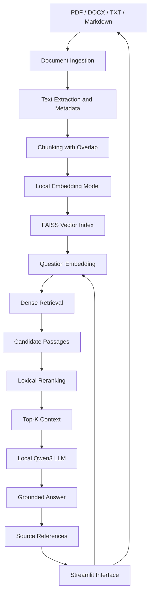

# VaultRAG: Private Document Intelligence with Local RAG

VaultRAG is a local Retrieval-Augmented Generation (RAG) system that enables users to search private documents, retrieve relevant information, and generate context-grounded answers using a locally executed Large Language Model (LLM).

The system combines semantic search, vector similarity, document retrieval, reranking, and language generation into a single question-answering pipeline. It supports PDF, DOCX, TXT, and Markdown documents, with source references that help users trace generated answers back to the retrieved evidence.

The objective is to make document-based question answering more useful, transparent, and privacy-conscious while providing a reproducible framework for evaluating retrieval quality and answer generation.

## 1. Why VaultRAG?

Searching large collections of documents manually can be slow and difficult, particularly when information is distributed across reports, policies, manuals, and technical documentation.

Traditional keyword search can miss relevant passages when the wording of a query differs from the wording in the document. A general-purpose LLM, meanwhile, may generate plausible answers without having access to the specific documents a user wants to consult.

VaultRAG addresses these limitations by connecting a retrieval system to a local language model.

Instead of asking the LLM to answer a question from its pretrained knowledge alone, the system retrieves relevant passages from an indexed document collection and supplies those passages as context for generation.

This approach provides three important capabilities:

- **Semantic retrieval:** Find passages based on meaning rather than exact keyword matches alone.
- **Grounded generation:** Generate answers using evidence retrieved from the indexed documents.
- **Source traceability:** Display the documents, page references where available, and retrieved passages supporting an answer.

The project also includes a public question-answering benchmark workflow, allowing retrieval performance to be evaluated independently of the interactive application.

## 2. What Is Retrieval-Augmented Generation?

Retrieval-Augmented Generation combines information retrieval with language generation.

A conventional language model generates an answer primarily from information encoded in its parameters and the prompt it receives. A RAG system introduces an external knowledge source that can be searched at inference time.

The process has two principal stages:

1. **Retrieval:** Identify the document passages most relevant to the user's question.
2. **Generation:** Provide the question and retrieved passages to an LLM to generate an answer.

Let:

- \(q\) denote the user's question.
- \(D\) denote the indexed document collection.
- \(R_k(q,D)\) denote the top-\(k\) passages retrieved for the question.
- \(G\) denote the language model.

The answer can be expressed as:

\[
\hat{y} = G\left(q, R_k(q,D)\right)
\]

Here, \(\hat{y}\) is the generated response, conditioned on both the question and the retrieved evidence.

The retrieval component determines which information reaches the model, while the generation component determines how that information is expressed as an answer.

This separation makes it possible to investigate retrieval errors and generation errors independently.

## 3. System Architecture

The application follows a modular pipeline that separates document preparation, retrieval, generation, evaluation, and the user interface.



The ingestion and indexing stages prepare the document collection before questions are asked. At query time, the question is embedded, relevant passages are retrieved and reranked, and the local LLM generates a response using the selected context.

The system can also operate through a command-line interface, making the backend usable without Streamlit.

## 4. Technology Stack

| Component | Technology | Purpose |
|---|---|---|
| Programming language | Python | Application and pipeline implementation |
| Document extraction | pypdf, python-docx | Read supported document formats |
| Embedding model | BAAI/bge-small-en-v1.5 | Convert text into semantic vectors |
| Vector database | FAISS | Efficient similarity search |
| Retrieval refinement | Dense similarity + lexical overlap | Reorder candidate passages |
| Generation model | Qwen/Qwen3-0.6B | Generate answers from retrieved context |
| Model runtime | PyTorch, Transformers | Local model inference |
| Public benchmark | SQuAD | Reproducible question-answering evaluation |
| User interface | Streamlit | Document upload and interactive question answering |

The initial implementation uses local model execution and does not require a paid LLM API.

Model weights and dependencies must be downloaded during setup. Their respective licenses and usage terms should be checked before redistribution or commercial deployment.

## 5. Document Ingestion and Preprocessing

### 5.1 Document ingestion

Document ingestion converts files into structured text records that downstream components can process.

VaultRAG supports:

- PDF
- DOCX
- TXT
- Markdown

For PDFs, the extraction pipeline processes pages individually and preserves page numbers where available. For DOCX and text-based files, the extracted content is stored with document-level metadata.

A record contains fields such as:

```python
{
    "document_id": "employee_policy",
    "document_name": "employee_policy.pdf",
    "page": 12,
    "text": "The extracted document text..."
}
```

Preserving metadata is essential because the system must identify the source of a retrieved passage, not merely return its text.

The current implementation uses text extraction rather than OCR. Scanned PDFs that contain images instead of selectable text may require an additional OCR stage.

### 5.2 Text chunking

Documents can contain thousands of words, making it impractical to embed and retrieve an entire document as one unit.

Chunking divides the extracted text into smaller passages that can be indexed independently.

VaultRAG uses configurable word-based chunks with overlapping content.

Let:

- \(L\) be the chunk size.
- \(O\) be the overlap.
- \(S\) be the step between consecutive chunks.

Then:

\[
S = L - O
\]

For example, with a chunk size of 650 words and an overlap of 100 words:

\[
S = 650 - 100 = 550
\]

Consecutive chunks therefore share 100 words, helping preserve context across chunk boundaries.

The initial configuration is:

| Parameter | Value |
|---|---:|
| Chunk size | 650 words |
| Overlap | 100 words |
| Step size | 550 words |

These values are starting hyperparameters rather than universally optimal settings. Their impact should be assessed experimentally.

### 5.3 Metadata preservation

Every chunk retains its source document, document identifier, page reference where available, and unique chunk identifier.

This allows the system to connect a generated answer to the passages that were actually supplied to the LLM.

## 6. Semantic Embeddings

An embedding model converts text into a numerical vector representing its semantic characteristics.

VaultRAG uses `BAAI/bge-small-en-v1.5` to encode document chunks and user questions into a common vector space.

For a document chunk \(d_i\), the embedding is:

\[
\mathbf{v}_i = f_{\theta}(d_i)
\]

For a query \(q\):

\[
\mathbf{v}_q = f_{\theta}(q)
\]

Here, \(f_{\theta}\) represents the pretrained embedding model.

Texts with related meanings can have similar vectors even when they do not contain identical words.

### Cosine similarity

A common similarity measure for embeddings is cosine similarity:

\[
\operatorname{sim}(\mathbf{u},\mathbf{v})
=
\frac{\mathbf{u}^{\top}\mathbf{v}}
{\|\mathbf{u}\|_2\|\mathbf{v}\|_2}
\]

When embeddings are normalized to unit length, this simplifies to:

\[
\operatorname{sim}(\mathbf{u},\mathbf{v})
=
\mathbf{u}^{\top}\mathbf{v}
\]

VaultRAG normalizes embeddings before indexing them. FAISS then performs inner-product search, which corresponds to cosine similarity for these normalized vectors.

## 7. Vector Search with FAISS

FAISS is a library for efficient similarity search over dense vectors.

Instead of comparing a question against every document using literal string matching, VaultRAG searches the embedding index to identify semantically similar chunks.

The retrieval objective is:

\[
R_k(q,D)
=
\underset{d_i \in D}{\operatorname{TopK}}
\operatorname{sim}
\left(
f_{\theta}(q), f_{\theta}(d_i)
\right)
\]

The initial implementation uses `IndexFlatIP`, an exact inner-product search index.

This provides a straightforward, reproducible baseline. Its search cost grows with the number of indexed vectors, so approximate nearest-neighbour indexes can be considered if the collection becomes substantially larger.

The vector index and its metadata are persisted locally, allowing the application to reuse an existing index instead of rebuilding it for every question.

## 8. Retrieval and Reranking

### 8.1 Dense retrieval

The retrieval stage embeds the user's question and searches the FAISS index for candidate passages.

The initial pipeline retrieves up to 10 candidate chunks before selecting the final context.

Dense retrieval is useful when a question and its supporting passage use different wording but express related concepts.

### 8.2 Lexical reranking

The initial implementation adds a lightweight reranking stage that combines dense similarity with lexical token overlap.

Let:

- \(s_d\) be the normalized dense similarity score.
- \(s_l\) be the lexical overlap score.

The current reranking score is:

\[
s_{\text{rank}}
=
0.75s_d + 0.25s_l
\]

The lexical component measures how much of the query's token content overlaps with the candidate passage.

The final ranking therefore considers both semantic similarity and direct word overlap.

This is a lightweight heuristic reranker, not a trained cross-encoder. A cross-encoder reranker is a potential future improvement when more precise relevance estimation is required.

The system selects the top five passages as the initial generation context.

## 9. Local LLM and Grounded Generation

VaultRAG uses `Qwen/Qwen3-0.6B` as its initial local generation model.

The model receives:

- The user's question
- The retrieved document passages
- Instructions to avoid unsupported claims
- Source identifiers for citation

The generation prompt instructs the model to answer using the supplied context and to acknowledge when the documents do not contain sufficient evidence.

A simplified representation is:

```text
SYSTEM INSTRUCTIONS
Answer using only the supplied document context.
Do not invent facts.
State when the evidence is insufficient.
Cite the supporting source identifiers.

DOCUMENT CONTEXT
[Source 1] ...
[Source 2] ...

USER QUESTION
...

GENERATED ANSWER
...
```

The intended behaviour is to produce answers grounded in the retrieved evidence rather than relying on unsupported outside information.

Prompt instructions improve the chances of grounded responses but do not guarantee that every answer will be correct. The retrieval results and generated citations should be inspected during evaluation.

### Why use a local model?

Running the model locally removes the need to transmit document contents to an external LLM inference API during ordinary generation.

The trade-off is that smaller models can have limitations in reasoning, instruction following, answer completeness, and generation speed. The initial configuration prioritizes accessibility and local execution over maximum model capability.

## 10. Source References and Traceability

A document question-answering system should provide more than a fluent response. Users also need to understand where its information came from.

VaultRAG returns the selected passages alongside the answer and displays metadata such as:

- Source document name
- Page number, when available
- Retrieved text
- Dense similarity score
- Lexical overlap score
- Reranking score

These references make it easier to inspect the evidence behind a response.

A citation indicates which retrieved passage was supplied to the model; it should not automatically be interpreted as proof that every statement in the answer is fully supported. Faithfulness must be evaluated separately.

## 11. Dataset and Evaluation Strategy

VaultRAG separates public benchmark evaluation from the private-document application workflow.

### 11.1 SQuAD

The initial benchmark uses the Stanford Question Answering Dataset (SQuAD), a question-answering dataset containing questions, passages, and reference answers derived from Wikipedia.

The project uses the validation split for its initial retrieval and answer-evaluation workflow.

SQuAD provides a reproducible source of questions and answer references, allowing the system to be tested against known examples.

Dataset attribution and licensing requirements must be respected. SQuAD is distributed under CC BY-SA 4.0; consult its dataset card for the applicable terms.

### 11.2 Two distinct workflows

**Public benchmark workflow**

The public corpus supports repeatable experiments on retrieval and answer generation.

**Private-document workflow**

Users provide their own PDF, DOCX, TXT, or Markdown documents. These documents are indexed locally and used for interactive question answering.

The public benchmark is not a substitute for domain-specific evaluation. A system performing well on Wikipedia-derived questions may behave differently on legal, financial, technical, or company-policy documents.

## 12. Evaluation Metrics

Evaluation is necessary to distinguish a functioning application from a reliable retrieval and question-answering system.

### 12.1 Hit Rate@K

Hit Rate@K measures the fraction of questions for which at least one retrieved passage is identified as relevant within the top \(K\) results.

\[
\operatorname{HitRate@K}
=
\frac{1}{N}
\sum_{i=1}^{N}
\mathbb{1}
\left[
\text{a relevant passage appears in top }K
\right]
\]

Here, \(N\) is the number of evaluation questions.

A higher value indicates that relevant evidence is being found more consistently.

### 12.2 Precision@K

Precision@K measures the proportion of retrieved passages that are relevant within the top \(K\).

\[
\operatorname{Precision@K}
=
\frac{1}{N}
\sum_{i=1}^{N}
\frac{\text{relevant passages in top }K}{K}
\]

Precision helps measure how much of the selected context is useful rather than irrelevant.

### 12.3 Mean Reciprocal Rank

Mean Reciprocal Rank (MRR) rewards systems that rank a relevant passage near the top of the result list.

\[
\operatorname{MRR}
=
\frac{1}{N}
\sum_{i=1}^{N}
\frac{1}{r_i}
\]

Here, \(r_i\) is the rank of the first relevant result for question \(i\). If no relevant result is found, its reciprocal rank is zero.

Higher MRR indicates better ranking of the first relevant passage.

### 12.4 Exact Match

Exact Match measures whether a normalized prediction exactly matches at least one reference answer.

\[
\operatorname{EM}
=
\frac{1}{N}
\sum_{i=1}^{N}
\mathbb{1}
\left[
\hat{a}_i \equiv a_i
\right]
\]

Normalization may remove punctuation, articles, and differences in letter case.

Exact Match is strict: a correct answer with additional wording can receive a zero score.

### 12.5 Token-level F1

Token F1 measures the overlap between predicted and reference answer tokens.

\[
P = \frac{TP}{TP+FP}
\]

\[
R = \frac{TP}{TP+FN}
\]

\[
F_1 = \frac{2PR}{P+R}
\]

Here, \(TP\), \(FP\), and \(FN\) represent overlapping, unmatched predicted, and unmatched reference tokens under the evaluation procedure.

Token F1 provides a more flexible comparison than Exact Match, although it does not establish factual correctness or faithfulness on its own.

### 12.6 Latency

The application also measures retrieval and generation latency.

\[
T_{\text{total}}
=
T_{\text{retrieval}}
+
T_{\text{generation}}
+
T_{\text{other}}
\]

Retrieval latency measures the time required to find and rerank passages. Generation latency measures the time taken to produce the response.

Actual end-to-end latency can also include embedding, model loading, and other processing overhead. Measurements should therefore be interpreted alongside the timing boundaries used by each experiment.

### Evaluation limitations

The initial implementation uses answer-string matching against retrieved text to estimate relevance for retrieval metrics. This is a useful baseline, but it can miss passages that express an answer indirectly or count a passage as relevant merely because it contains an answer string.

Similarly, Exact Match and token F1 compare generated responses with reference answers but do not independently establish groundedness, citation correctness, or factual consistency.

More robust evaluation can include human-verified relevance labels, context relevance, answer faithfulness, and domain-specific test sets.

## 13. Experimental Design

VaultRAG is structured to support controlled experiments rather than relying exclusively on qualitative examples.

Potential comparisons include:

| Experiment | Configurations | Primary question |
|---|---|---|
| Chunking | Different chunk sizes and overlaps | How does segmentation affect retrieval? |
| Retrieval depth | Top-3, top-5, top-10 | How does candidate count affect relevance? |
| Reranking | Dense-only vs. hybrid heuristic | Does reranking improve result ordering? |
| Embeddings | Alternative local embedding models | Which representation retrieves better evidence? |
| Generation | Prompt variations or alternative local models | How does generation quality change? |

Each experiment should use a consistent evaluation set and report actual measured results.

A suitable results table is:

| Configuration | Hit Rate@5 | Precision@5 | MRR | Answer EM | Answer F1 |
|---|---:|---:|---:|---:|---:|
| Baseline | To be measured | To be measured | To be measured | To be measured | To be measured |
| Alternative chunking | To be measured | To be measured | To be measured | To be measured | To be measured |
| Reranking enabled | To be measured | To be measured | To be measured | To be measured | To be measured |

These values must be populated from completed experiments rather than estimates.

## 14. Streamlit Application

The Streamlit interface provides a practical way to interact with the retrieval pipeline.

Its initial functionality includes:

- Uploading supported document formats
- Saving documents to the local input directory
- Building or rebuilding the local index
- Asking questions about indexed documents
- Viewing generated answers
- Inspecting retrieved passages
- Reviewing document names and page references
- Viewing retrieval scores and latency

The UI is separated from the backend so that document ingestion, embedding, retrieval, generation, and evaluation remain reusable Python components.

This separation also makes it easier to test individual components without launching the interface.

## 15. Project Structure

```text
vault-rag/
├── app.py
├── main.py
├── requirements.txt
├── README.md
├── .gitignore
│
├── src/
│   ├── __init__.py
│   ├── config.py
│   ├── ingestion.py
│   ├── chunking.py
│   ├── embeddings.py
│   ├── vector_store.py
│   ├── dataset.py
│   ├── retrieval.py
│   ├── llm.py
│   ├── pipeline.py
│   └── evaluation.py
│
├── tests/
│   └── test_core.py
│
├── data/
│   ├── raw/
│   ├── processed/
│   └── evaluation/
│
├── vector_store/
│
└── outputs/
```

### Module responsibilities

| Module | Responsibility |
|---|---|
| `config.py` | Model identifiers, directories, and configuration |
| `ingestion.py` | Document reading and text extraction |
| `chunking.py` | Text segmentation and chunk metadata |
| `embeddings.py` | Local embedding generation |
| `vector_store.py` | FAISS indexing, persistence, and search |
| `dataset.py` | Loading and preparing the public benchmark |
| `retrieval.py` | Candidate reranking |
| `llm.py` | Local Qwen3 inference |
| `pipeline.py` | Connecting the components into end-to-end workflows |
| `evaluation.py` | Retrieval and answer metrics |
| `main.py` | Command-line execution |
| `app.py` | Streamlit interface |

## 16. Installation

### Prerequisites

- Python 3.10 or later, compatible with the selected dependencies
- Internet access for downloading dependencies and model weights during initial setup
- Sufficient memory and storage for the selected embedding model, local LLM, and indexed documents

CPU execution is supported by the intended setup, although model loading and generation may be slow on some machines.

### Create an isolated environment

On Windows PowerShell:

```powershell
git clone https://github.com/Arjun-08/vault-rag.git
cd vault-rag

python -m venv .venv
.venv\Scripts\activate

python -m pip install --upgrade pip
pip install -r requirements.txt
```

Using a project-specific environment keeps the dependencies isolated from unrelated Python and Anaconda projects.

## 17. Usage

### Build the public benchmark index

```powershell
python main.py --mode build --eval-limit 300
```

This downloads a subset of the SQuAD validation data, prepares document records, creates chunks, generates embeddings, and persists a FAISS index.

### Run evaluation

```powershell
python main.py --mode evaluate --eval-limit 300
```

The evaluation workflow builds its benchmark index, evaluates retrieval, samples examples for local generation evaluation, and writes measured metrics to `outputs/metrics.json`.

The first run may take longer because the required datasets and model weights must be downloaded.

### Index private documents

Place your files in `data/raw/`:

```text
data/raw/
├── employee_policy.pdf
├── technical_manual.docx
└── research_notes.txt
```

Then run:

```powershell
python main.py --mode index-local
```

The generated local index can then be used for document question answering.

### Ask a question from the terminal

```powershell
python main.py --mode ask --question "What does the document say about remote work?"
```

The command prints the answer, retrieved sources, and latency measurements.

### Launch the Streamlit interface

```powershell
streamlit run app.py
```

Upload documents, build the index, and submit questions through the browser interface.

The public benchmark and private-document workflows use the same default vector-store location in the initial implementation. Build the index for the intended workflow before querying it.

## 18. Privacy and Security Considerations

VaultRAG is designed to keep the main document-processing and inference pipeline local:

- Text extraction occurs locally.
- Embeddings are generated locally.
- The FAISS index is stored locally.
- Retrieval and reranking run locally.
- The selected LLM generates responses locally.

Once dependencies and model weights have been downloaded, ordinary local question answering does not require a paid cloud LLM API.

However, local execution alone does not provide comprehensive security. The current implementation is a single-user prototype and does not include enterprise-grade authentication, encryption at rest, multi-user authorization, or document-level access control.

Additional precautions are necessary before using genuinely sensitive material:

- Restrict access to document directories and model caches.
- Avoid committing private documents, indexes, or generated sensitive outputs to GitHub.
- Apply appropriate disk encryption and operating-system permissions.
- Review dependency and model-download behaviour.
- Implement authentication and document-level authorization before multi-user deployment.
- Validate that no sensitive content is written to unintended logs or shared locations.

The system should be described as a local, privacy-conscious prototype rather than a certified secure document platform.

## 19. Limitations

The current implementation provides a foundation for further engineering and experimentation.

Its main limitations include:

- **Model capability:** A compact local LLM may struggle with complex reasoning or lengthy contexts.
- **Retrieval quality:** Semantically similar passages are not always the passages that contain the answer.
- **Reranking:** The lexical reranker is a heuristic rather than a learned relevance model.
- **PDF extraction:** Scanned documents may require OCR.
- **Chunking:** Word-based segmentation does not always preserve complete semantic units.
- **Evaluation:** Answer-string matching and reference-answer metrics cannot fully assess factual faithfulness.
- **Performance:** CPU generation latency depends on model size, prompt length, hardware, and software configuration.
- **Access control:** The initial application does not isolate separate users' documents.
- **Citation reliability:** Retrieved source references improve traceability but do not guarantee that every generated claim is supported.

These limitations provide clear directions for future development and controlled experimentation.

## 20. Future Improvements

Potential extensions include:

- Hybrid dense and BM25 retrieval
- A trained cross-encoder reranker
- Query rewriting and multi-query retrieval
- Structure-aware and token-based chunking
- OCR for scanned documents
- Better context selection and compression
- Quantized local generation models
- Faithfulness and citation-correctness evaluation
- Domain-specific evaluation datasets
- Automated experiment reports and plots
- Persistent document management and index versioning
- Authentication and document-level access control
- More advanced UI support for conversation history

Each improvement can be evaluated against the existing retrieval and answer-quality baselines.

## 21. Conclusion

VaultRAG brings together document processing, semantic embeddings, vector search, reranking, local language generation, source traceability, and evaluation in a single modular application.

Its central design principle is to make external document evidence available at the moment a question is asked, enabling the LLM to generate responses grounded in a searchable knowledge collection.

By separating ingestion, retrieval, generation, and evaluation, the project provides a practical foundation for studying RAG systems and progressively improving their accuracy, efficiency, and reliability.

The long-term goal is to develop a document intelligence system in which users can retrieve relevant information from their own document collections, inspect the evidence behind generated answers, and retain control over where their data is processed.
